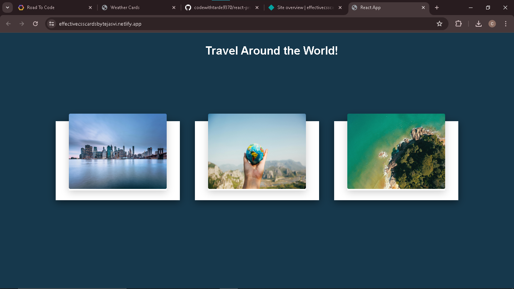
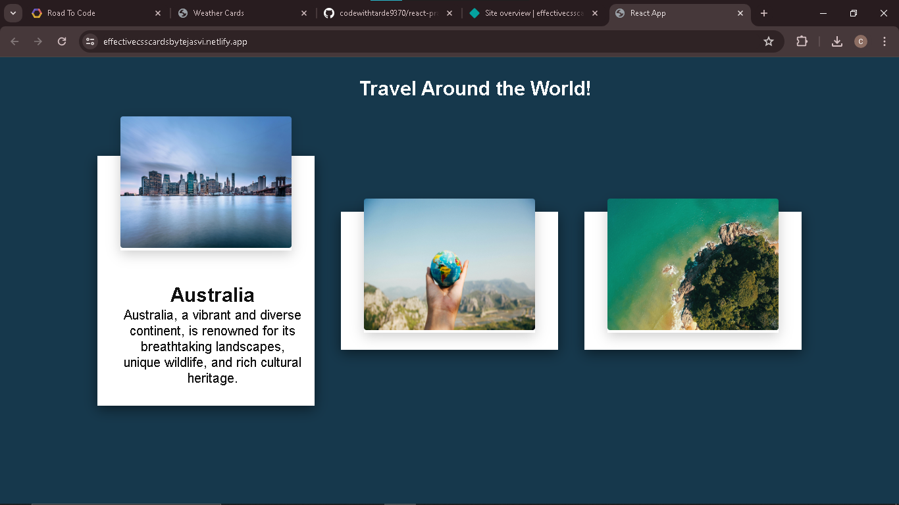

# Getting Started with Create React App

# Travel Around the World

# Project Overview
I have created a React app as a practice for CSS implementation for designing responsive and attractive cards with hover effects.

### How it works:
Hovering over cards increses the height of cards makes the information visible.

